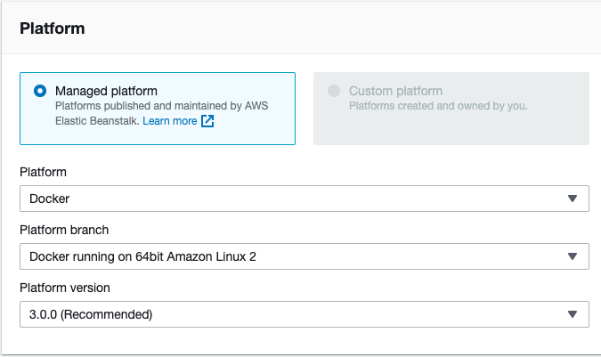

# Php Simple for AWS Elastic Beanstalk

With AWS Elastic Beanstalk : Single Container Docker environments

## Local Test Commands

Build Docker

    docker build -t my-php-simple .
    
Start a new Docker container
    
    docker run -d --name my-app -p 8000:80 my-php-simple

After build, create a new container 
    
    docker stop my-app && docker rm $_ && docker run -d --name $_ -p 8000:80 my-php-simple
    
Access [http://localhost:8000/](http://localhost:8000/)

## Some Tips

Choose **ONE of follows** method to build app for AWS Elastic Beanstalk with Docker platform

1. Zip this folder, and deploy to Elastic Beanstalk.
    
        zip -r '../aws-eb-php-simple.zip' *
    
    Dockerfile **MUST** have `EXPOSE` & `CMD`。Without them can not be deployed

        FROM php:7.2-apache
        
        COPY src/ /var/www/html/
        
        EXPOSE 80
        CMD ["apache2-foreground"]
        
2. One Dockerfile as follows is working too.

        FROM php:7.2-apache
        
        RUN apt-get update
        RUN apt-get install -y git
        
        RUN mkdir /myapp && cd /myapp && git clone https://github.com/iascchen/aws-eb-php-simple.git && cp -r /myapp/aws-eb-php-simple/src/* /var/www/html/
        
        EXPOSE 80
        CMD ["apache2-foreground"]

